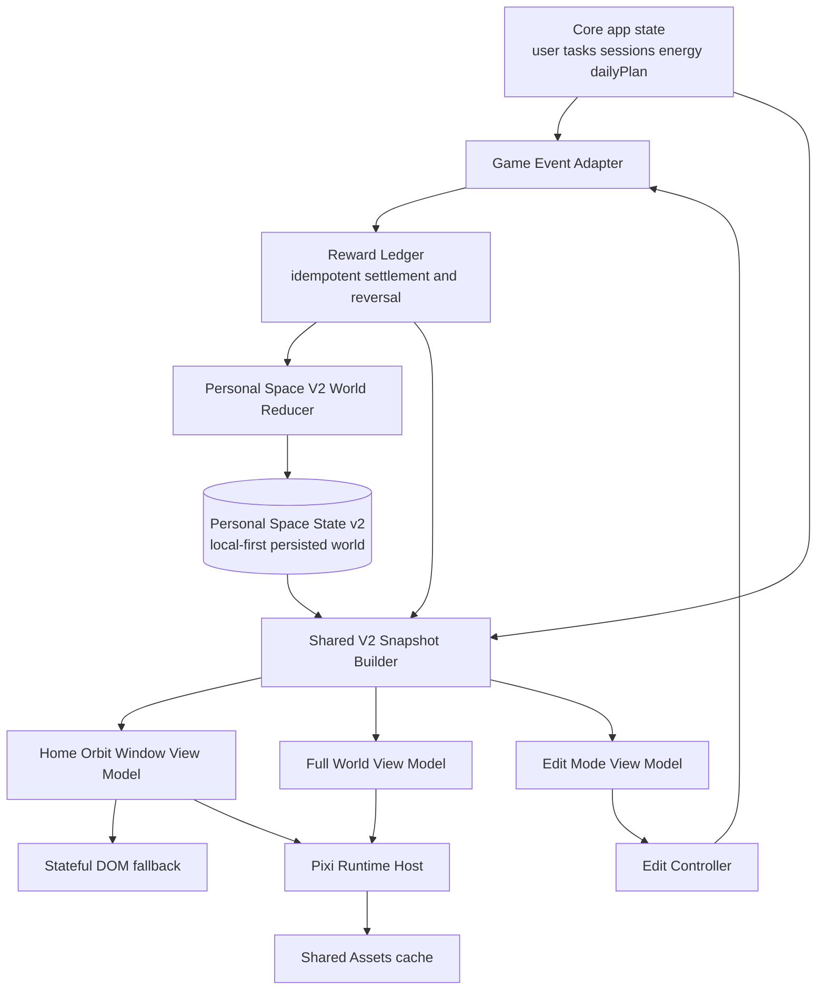

# Personal Space V2 Technical Design

> Status: implementation contract for the first Vertical Slice  
> Audit baseline: Orbit `v1.20.6`, repository `main` at `77a9b9b`  
> Scope: Vanilla JavaScript PWA, PixiJS 8, local-first V2 state, legacy-safe rollout

## 1. Purpose and Decision Summary

Personal Space V2 turns completed real-world work into an immediately visible world change. The first Vertical Slice is not complete unless the same world is visible in both places:

1. the home-page `Orbit Window`, where the normal task loop happens; and
2. the full Personal Space page, where the user can inspect the world and enter a minimal Edit Mode.

The implementation must preserve the existing PWA and legacy Personal Space while adding one V2 world model with three presentation modes:

```js
renderMode: 'home-window' | 'full-world' | 'edit'
```

The V2 slice uses one fixed canonical camera and a 3:2 composition. The existing 16:9, left/center/right Idle Growth Window remains available to legacy mode and as future camera-profile research; it is not the V2 Vertical Slice runtime.

The core decisions are:

- Keep Vanilla JavaScript, ES modules, the hash router, current task/session flow, and localStorage-first behavior.
- Add PixiJS 8 behind a lazy runtime host. Do not make Pixi a blocking home-page dependency.
- Render a stateful static fallback before Pixi initializes and whenever Pixi fails.
- Keep one canonical V2 state. Home, full-world, and edit View Models are read-only projections of that state.
- Apply world changes only through game events, the Reward Ledger, and the world reducer.
- Preserve legacy state and assets; select legacy or V2 with `personalSpaceRuntime: 'legacy' | 'v2'`.
- Do not add or change Supabase schema, auth, deployment, or CI without the separate approval required by `AGENTS.md`.

## 2. Repository Audit: Code Facts

Code and tests are the behavioral baseline. Older design documents remain useful context but do not override these facts.

| Area | Current repository fact | Consequence for V2 |
|---|---|---|
| Home | `pwa/js/pages/home.js:130-190` renders stats, effective-day state, plans, tasks, and session history. It renders no Personal Space content. | Orbit Window must be inserted after the stats/effective row and before the daily-plan section. |
| Personal Space page | `pwa/js/pages/personalSpace.js:125-179` renders Idle Growth Window as a separate card and editor overlay. `pwa/js/pages/personalSpace.js:181-192` then renders a separate Current Scene Layer. | These are two presentations with different layout stores, not the required shared V2 world. |
| Personal Space state | `pwa/js/personalSpace/gameState.js:5-25` defaults to `version: 1`. It stores `placedItems` and `idleWindowLayouts` separately. `pwa/js/personalSpace/gameState.js:150-190` normalizes and saves but does not run a versioned migration. | Add an explicit, pure, idempotent V1-to-V2 migration. Preserve both legacy collections during rollout. |
| Current View Models | `pwa/js/personalSpace/index.js:13-43` derives level, gold, ownership, unlocks, and active scene. `pwa/js/personalSpace/idleWindow/index.js:13-32` derives only XP, stage, layout, and assets. | Neither model contains Active Project, Main Quest, Companion state, recent world change, pending reveal, time band, weather, or V2 interactables. |
| Scene runtime | `pwa/js/personalSpace/sceneRuntime.js:61-106` builds DOM markup. It is not a Pixi runtime. | Preserve it as the legacy renderer; do not retrofit Pixi into it. |
| Idle renderer | `pwa/js/personalSpace/idleWindow/renderer.js:28-60` and `:80-148` render layered `` elements. | Layout and asset metadata are reusable; rendering must move behind the V2 runtime adapter. |
| Layout metadata | `pwa/js/personalSpace/idleWindow/layouts.js:78-97` defines placement planes. `:154-170` defines a desk footprint, support surface, and character anchor. `:391-460` defines percent placements, surfaces, footprints, and anchors. | Reuse the data concepts and placement math in V2. Do not require the current camera-profile UI. |
| Editor feasibility | `pwa/js/personalSpace/idleWindow/editorRuntime.js:597-700` implements support-surface snap, depth hints, anchor following, and overlap warnings. `:492-511` removes its listeners. | Extract or adapt these pure behaviors for V2 Edit Mode; never initialize this full editor on the home page. |
| Character/Companion | `pwa/js/personalSpace/idleWindow/assetRegistry.js:530-554` registers one four-frame protagonist idle asset. `pwa/js/personalSpace/idleWindow/layouts.js:313-327` has one protagonist layer and an empty effects layer. | Work, celebrate, rest, walk, inspect, Companion sprites, reactions, and effects still need contracts and assets. |
| Interaction data | `pwa/js/personalSpace/world/sceneGraph.js:36-45` and `:84-130` define office exit, window, desk, and Companion nodes. `pwa/js/personalSpace/interactionBus.js:1-19` is a small event bus. | Reuse node identifiers and commands as V2 interactable inputs, but route mutations through game events rather than View Models. |
| Camera/aspect | `pwa/assets/style.css:1455-1460` fixes the current Idle Growth Window at 16:9. `pwa/js/personalSpace/idleWindow/layouts.js:42-77` uses 1672x941 and three camera profiles. | V2 must use new 3:2-only classes, layouts, and assets. Do not mutate legacy selectors or asset IDs. |
| Routing lifecycle | `pwa/js/router.js:36-64` invokes render functions without a route cleanup contract. Personal Space only cleans prior runtime state on its next render at `pwa/js/pages/personalSpace.js:28-39`. | Add a renderer-returned cleanup hook so leaving a route releases observers, listeners, animation frames, and the Pixi application. |
| Loading | `pwa/js/router.js:5-10` synchronously imports the full Personal Space page. Pixi is not a dependency in `package.json`. | Keep the HTML shell and View Model code small; dynamically import the Pixi host only after a lazy trigger. |
| Service Worker | `pwa/sw.js:50-60` precaches Personal Space JS modules. Its image/other branch at `pwa/sw.js:122-126` returns a network response without adding it to Cache Storage. | Do not precache every V2 texture. Add an approved, versioned runtime-cache strategy before promising offline texture reuse. |
| Test baseline | `tests/unit/personalSpaceIdleWindow.test.js:23-361` covers asset resolution, placement, support surfaces, anchors, cameras, and collision. Existing Personal Space unit suites pass. | Preserve these legacy tests and add V2 state, home, lifecycle, fallback, and reward-loop coverage rather than rewriting them. |

### 2.1 Documentation Precedence and Corrections

The following documents describe earlier phases and need scoped interpretation:

- `docs/idle-window-art-direction-spec.md:11-19` requires three 16:9 camera profiles. That remains the legacy/proof contract. It is superseded for the V2 Vertical Slice by one fixed 3:2 canonical camera.
- `pwa/assets/personal-space/idle-window/README.md:91-96` describes the Idle Growth Window as a separate card with its own `idleWindowLayouts`. That remains true of the prototype, but it is not the V2 shared-state architecture.
- `docs/life-sim-architecture.md` says Phase 1 should avoid schema changes. This V2 design permits a versioned local Personal Space state migration. It still forbids an unapproved Supabase schema change.
- `docs/refactor-handoff.md` records an older `v1.20.3` snapshot. Its module-boundary observations are useful, but the V2 audit baseline is `v1.20.6`.
- The Service Worker comment says images are cache-first, but the current miss path does not persist the fetched response. Tests and implementation must follow the code, not the comment.

## 3. Reuse, Adapt, and Deprecation Boundaries

### 3.1 Reuse Directly

- `ownedItems`, `placedItems`, `hiddenStats`, selected-scene, and memory-scene fields from `gameState.js`.
- Percent-based coordinates, top-left origin, placement planes, footprints, support surfaces, and character anchors.
- `resolveIdleWindowSupportPlacements()` math from `idleWindow/index.js:76-175` after extracting it from prototype-specific naming.
- Support-surface snapping and overlap calculation from `idleWindow/editorRuntime.js`.
- Office interaction node IDs and the interaction-bus pattern.
- The clean office center background and curated office props as visual references and temporary static fallback inputs.
- Existing legacy scene unlock, floor map, memory-scene, and furniture data.

### 3.2 Adapt Behind New Interfaces

- Asset registry entries need V2 roles, 3:2 dimensions, stage/project-phase metadata, safe-zone metadata, provenance, and runtime bundle IDs.
- Existing idle placement overrides may be mapped into a V2 canonical layout only when item ID and placement-plane mapping are deterministic.
- The existing editor behavior should become an Edit Mode controller that consumes a V2 View Model and emits commands.
- Scene graph actions should emit typed game commands instead of directly saving world state.

### 3.3 Keep as Legacy; Do Not Delete

- `pwa/js/personalSpace/sceneRuntime.js`.
- The current 16:9 Idle Growth Window renderer, editor, layouts, camera profiles, and assets.
- `idleWindowLayouts` and `cameraProfileId` in V1 state.
- Current Personal Space page behavior when `personalSpaceRuntime === 'legacy'`.

### 3.4 Do Not Use as V2 Completion Evidence

- Level-gated prop appearance is not Active Project progress.
- A static room image without world status is not a valid home Orbit Window fallback.
- The current four-frame idle sprite is not the six-action protagonist contract.
- A `qc: 'passed'` registry string alone is not sufficient alpha-edge, provenance, or runtime QA.
- Multi-camera proofs do not satisfy the fixed-camera 3:2 Vertical Slice.

## 4. Target Architecture



Rules enforced by the architecture:

1. A View Model never writes persisted state.
2. Pixi display objects never become the canonical state.
3. Home, full-world, and edit modes carry the same `worldRevision`, project progress, Companion state, and placement snapshot.
4. A reward event is applied once by ID. Rendering or route changes cannot award anything.
5. Session reversal is a ledger/world event, not a manual subtraction in a page renderer.
6. The DOM fallback and Pixi scene are two renderers of the same View Model.

## 5. Proposed Module Responsibilities

```text
pwa/js/personalSpace/v2/
├── index.js                     # Public V2 facade
├── runtimeMode.js               # legacy/v2 feature-flag resolution
├── state.js                     # V2 default, normalization, migration contract
├── worldReducer.js              # Pure event -> world transition
├── snapshot.js                  # Joins core, ledger, and V2 state
├── viewModels.js                # home-window/full-world/edit projections
├── commands.js                  # Typed UI/runtime commands
├── content/
│   ├── workspaceUpgrade.js      # 0/25/50/75/100 project phases
│   └── assetManifest.js         # V2 bundle and safe-zone metadata
├── runtime/
│   ├── runtimeHost.js           # Lazy triggers and single-instance ownership
│   ├── pixiRuntime.js           # PixiJS 8 Application lifecycle
│   ├── assetLoader.js           # Assets bundles/cache policy
│   ├── sceneBuilder.js          # VM -> Pixi display tree
│   ├── animationController.js   # protagonist/Companion/reward animation
│   └── lightingController.js    # time-band/weather presentation
└── ui/
    ├── orbitWindowShell.js       # synchronous stateful DOM fallback
    ├── worldMode.js              # full-world controls and status
    └── editMode.js               # minimal editor controls
```

Reward Ledger and session-settlement modules may live outside `personalSpace/v2/` when their scope is app-wide. The V2 package depends on their public event contract, not on page-specific implementation details.

## 6. Shared Data Flow

### 6.1 Session Completion

```text
Session safely committed
  -> emit immutable session-settled game event
  -> Reward Ledger inserts event once by deterministic ID
  -> worldReducer applies unapplied ledger event
  -> persist Personal Space V2 state with incremented worldRevision
  -> publish world-state-updated event
  -> Home Orbit Window updates DOM state immediately
  -> Pixi runtime plays the matching reaction when ready
  -> acknowledge reveal only after visual or reduced-motion presentation
```

The task/session commit must succeed before world rewards are created. If persistence is interrupted between ledger and world writes, the next load replays unapplied ledger events by ID. Replaying is safe because both ledger settlement and the world reducer are idempotent.

### 6.2 Session Reversal

```text
Session reversal committed
  -> append reversal ledger event referencing original event ID
  -> worldReducer reverses project/stat/world effects once
  -> increment worldRevision
  -> home and full-world View Models show the same reverted state
```

Never delete history to implement reversal. A reversal must remain traceable and must not produce a second positive reward after reload or remote sync.

### 6.3 Read Path

```text
core state + normalized V2 state + unapplied/pending ledger view
  -> buildPersonalSpaceV2Snapshot()
  -> buildPersonalSpaceV2ViewModel(snapshot, { renderMode })
  -> DOM fallback and/or Pixi runtime
```

Main Quest, player level/XP, and time band should be derived from their existing canonical sources. Do not copy them into V2 storage merely for rendering convenience.

## 7. Personal Space State V2

The first implementation should remain local-first. The proposed shape is intentionally additive:

```js
{
  version: 2,

  // Existing fields remain readable by legacy mode.
  spentGold: 0,
  ownedItems: [],
  placedItems: [],
  idleWindowLayouts: {},
  selectedSceneId: 'rough-room',
  memoryViewSceneId: null,
  selectedThemeId: 'default',
  companionRelationshipStage: 'stranger-observer',
  memorySceneLog: {},
  hiddenStats: { discipline: 0, depth: 0, vitality: 0, order: 0, courage: 0, craft: 0 },

  v2: {
    worldRevision: 0,
    activeProject: {
      id: 'workspace-upgrade',
      progress: 0,
      phaseIndex: 0,
      completedAt: null
    },
    companion: {
      relationshipStage: 'stranger-observer',
      activity: 'observe',
      dialogueKey: null,
      lastReactionEventId: null
    },
    weather: 'clear',
    recentWorldChangeEventId: null,
    pendingRevealIds: [],
    lastAppliedLedgerEventId: null,
    layouts: {
      'building-formal-workstation': {
        sceneId: 'office-corner',
        placements: {}
      }
    }
  },

  migration: {
    fromVersion: 1,
    migratedAt: null,
    unmappedPlacements: []
  }
}
```

This shape is a contract proposal, not authorization to change Supabase. Before implementation, names shared with the Reward Ledger design must be reconciled so no second ledger cursor or pending-reveal store is invented.

### 7.1 Canonical and Derived Fields

| Data | Canonical source | V2 behavior |
|---|---|---|
| XP, Level | Existing user/progression state | Derived into View Model. |
| Main Quest | Existing tasks and daily plan, plus quest rules | Derived; do not duplicate task progress. |
| Active Project | `personal-space-state.v2.activeProject` | Shared by all render modes. |
| Companion relationship/activity | `v2.companion`, seeded from legacy relationship field | Shared by all render modes. |
| Furniture ownership | Existing `ownedItems` | Reused through a V2 adapter. |
| Legacy placements | Existing `placedItems` and `idleWindowLayouts` | Preserved for legacy and migration input. |
| V2 canonical placements | `v2.layouts[layoutId].placements` | One placement snapshot for home, full, and edit. |
| Time band | Existing time-band logic/current time | Derived; not persisted as continuously changing state. |
| Weather | V2 world state | Persisted because it affects scene identity and reload consistency. |
| Pending reveal | Reward/ledger event IDs | Persist IDs, not copied reward values. |

### 7.2 Migration Contract

`migratePersonalSpaceStateV1ToV2(raw)` must be a pure function with these guarantees:

- V1 input produces a valid V2 object without deleting or renaming legacy fields.
- V2 input returns an equivalent V2 object; repeated migration is idempotent.
- `ownedItems`, `placedItems`, hidden stats, selected scenes, and memory logs are preserved.
- Legacy Companion relationship stage seeds `v2.companion.relationshipStage` once.
- Only deterministic, allow-listed prototype placement IDs are mapped into the V2 canonical 3:2 layout.
- Camera-profile choice and perspective variant are not copied into fixed-camera V2 state.
- Unmapped placement entries are preserved in legacy state and summarized under `migration.unmappedPlacements`; V2 uses a safe default position.
- Migration never awards XP, Gold, project progress, hidden stats, or relationship progress.
- Migration does not write storage. The caller validates first, then performs at most one migration write.
- A failed migration returns the legacy-safe path without overwriting the original record.

Tests must compare serialized outputs from first and repeated migration, not only selected fields.

### 7.3 Feature Flag and Rollback

Add a stable runtime mode:

```js
personalSpaceRuntime: 'legacy' | 'v2'
```

Rollout rules:

- Default to `legacy` until V2 migration, fallback, and core-loop tests pass.
- Tests and development may explicitly select `v2`.
- When release criteria pass, change the default through one reviewed change; retain the local override for rollback.
- `legacy` mode must not read or mutate V2-only world fields.
- `v2` mode may read legacy ownership and migration inputs but writes only the canonical V2 world/layout locations.
- A Pixi initialization failure does not change the flag and does not switch state stores; it shows the V2 DOM fallback.
- Do not delete legacy code or data in the first V2 release.

## 8. Render Modes

All modes receive the same base View Model and `worldRevision`. Only controls, scale, and interaction affordances differ.

| Mode | Surface | Required behavior | Forbidden behavior |
|---|---|---|---|
| `home-window` | Home core content, fixed 3:2 | Show room, protagonist action, Companion, Active Project and progress, Main Quest, recent change, pending event. Offer only high-value clicks. | No furniture drag, full inventory, shop, camera switch, or debug data. |
| `full-world` | Personal Space page, fixed 3:2 | Show the same state at larger scale, scene interactions, project detail, dialogue, and route to Edit Mode. | No different project/Companion/placement state and no default editor clutter. |
| `edit` | Full Personal Space overlay/page | Edit the same canonical V2 placements, validate planes/surfaces, show overlap warnings, persist commands. | Never mount on home; never award rewards; no independent camera profile. |

### 8.1 Mandatory Home Orbit Window

In the current home markup, insert the Orbit Window between the effective-day/stats area and the daily plan (`pwa/js/pages/home.js:135-144`). It must be visible by default and must not require expansion.

The synchronous shell must include:

- a stateful poster or last-saved preview;
- Active Project name and progress;
- Main Quest summary/action target;
- protagonist and Companion accessible status text;
- recent world change or pending-event cue;
- a clear action to open full Personal Space.

The shell is not merely a loading placeholder. If canvas, WebGL, dynamic import, or textures fail, the same current project/quest/world state remains usable in DOM.

After an Instant Task or a Focus Session settlement, the home View Model must update immediately. Pixi readiness only determines whether the feedback is animated; it must not determine whether the reward is visible.

### 8.2 Reward Presentation Responsibility

- Small rewards play inside Orbit Window with a short protagonist/Companion reaction and accessible numeric summary.
- Medium rewards may temporarily expand the window without taking over the task flow.
- Major project, room, chapter, relationship-stage, or key level milestones may open a full-screen reveal.
- After any reveal, Orbit Window renders the updated persisted state.
- With reduced motion, replace movement/particles with a short crossfade and immediate text summary.

## 9. PixiJS 8 Runtime Contract

PixiJS 8 official lifecycle guidance is reflected in this contract:

- `Application` initialization is asynchronous; create the application and await its `init()` before treating the canvas as ready.
- Use the Pixi `Assets` layer as the centralized promise/cache boundary. Repeated requests for one asset key should reuse the cached result.
- Call application `destroy()` during final unmount. Treat display-tree destruction and shared texture-cache destruction as separate decisions.

### 9.1 Packaging in This Repository

Orbit has no bundler and deploys `pwa/` directly. A bare browser import such as `import 'pixi.js'` will not resolve on GitHub Pages. The approved no-bundler path is:

1. pin PixiJS 8 in `package.json` and `package-lock.json`;
2. add a deterministic script that copies the package's browser ESM distribution and license into `pwa/vendor/`;
3. commit the vendored browser artifact required by the static deployment;
4. dynamically import the vendored module from `pixiRuntime.js`;
5. verify the vendor artifact version against `package-lock.json` in tests or lint tooling.

Do not depend on a CDN for the first Vertical Slice. A CDN would weaken offline behavior, CSP control, version reproducibility, and fallback testing.

### 9.2 Runtime Host State Machine

```text
unmounted
  -> fallback-mounted
  -> loading-runtime
  -> initializing-pixi
  -> ready
  -> suspended
  -> ready
  -> destroying
  -> destroyed

Any load/init/context failure
  -> fallback-mounted + recoverable error state
```

Required host methods:

```js
mount({ container, viewModel, renderMode })
update(nextViewModel)
suspend(reason)
resume()
destroy({ releaseSceneAssets })
```

Behavioral requirements:

- `mount()` and `destroy()` are idempotent.
- At most one active Pixi `Application` exists across home and full Personal Space.
- Do not hide the DOM fallback until the first complete Pixi frame is ready.
- `update()` accepts immutable View Models and rejects stale lower `worldRevision` values.
- Home-to-full route changes destroy or transfer the canvas host before mounting the next host.
- Shared Assets-owned textures survive ordinary route transitions; scene bundles can be released by an explicit memory policy.
- Final app teardown calls Pixi `destroy()` and removes context/event listeners. It must not accidentally destroy textures still owned by the shared Assets cache.
- WebGL context loss suspends animation and reveals fallback. Context restoration rebuilds from the latest View Model, never from old display-object state.

### 9.3 Lazy Initialization Triggers

Initialize the interactive runtime after the first applicable condition:

- Orbit Window intersects the viewport;
- the user activates the window;
- a Session is about to settle and assets are locally available;
- the browser reaches an idle period;
- the full Personal Space route is opened.

Use `IntersectionObserver`, `requestIdleCallback` with a timeout fallback, and dynamic `import()`. Do not import Pixi or the V2 editor from the synchronous home module.

## 10. Route and Page Lifecycle

The router needs one explicit cleanup contract. Page renderers may return a cleanup function:

```js
const cleanup = renderPageModule(content);
activeRouteCleanup = typeof cleanup === 'function' ? cleanup : null;
```

Before rendering any route, including a same-route refresh:

1. invoke the prior cleanup once;
2. clear the registered cleanup reference;
3. render the next page;
4. register its cleanup.

Home cleanup must disconnect observers, cancel idle callbacks/animation frames, unsubscribe from world events, and destroy or transfer the runtime host. Personal Space cleanup must also close Edit Mode, remove global pointer/orientation handlers, and release the active scene bundle according to policy.

`visibilitychange` behavior:

- hidden page: suspend ticker, particles, and nonessential timers;
- visible page: rebuild from the latest View Model, then resume;
- do not settle rewards or mutate world state on visibility events.

## 11. V2 Visual and Asset Contract

### 11.1 Coexistence

| Contract | Legacy/proof | Personal Space V2 Vertical Slice |
|---|---|---|
| Aspect | 16:9 | 3:2 |
| Logical size | Current 1672x941-oriented prototype | 960x640 |
| Source output | Existing PNG dimensions | 1920x1280 |
| Camera | left/center/right profiles | one fixed canonical camera |
| Layout store | `idleWindowLayouts` and legacy `placedItems` | one `v2.layouts` snapshot shared by all V2 modes |
| Renderer | DOM layered prototype/current scene | Pixi viewer plus stateful DOM fallback |
| Editing | Prototype overlay with camera switching | minimal fixed-camera V2 editor |

Use separate V2 asset IDs, layout IDs, CSS selectors, and asset folders. Do not repurpose `office-angle-center-v2` as a final 3:2 asset by silently stretching it. It may be the strict visual reference for regenerating or authoring the canonical 3:2 room.

### 11.2 First Scene Bundle

The `workspace-upgrade` bundle contains only the first Building-stage slice:

- one 3:2 empty canonical room background;
- one window/background layer;
- day and night lighting profiles;
- a curated 8-12 furniture/prop set;
- protagonist `idle`, `work`, `celebrate`, `rest`, `walk`, and `inspect` actions;
- one Companion with 3-4 reactions;
- Workspace Upgrade phases at 0/25/50/75/100;
- two weather effects;
- only the interactables required by the first flow.

Project phases must be selected from project progress, not from player level. Layout metadata should place all critical actors and project objects inside a declared 3:2 safe composition zone.

### 11.3 Asset QA

Before a prop enters a Pixi bundle:

- dimensions and expected alpha mode match the manifest;
- transparent RGB is cleared or edge colors are safely despilled to prevent bilinear fringe;
- no opaque chroma-key pixels remain;
- source/reference, generated output, approval status, license, model/workflow version, and known issues are recorded;
- a dark-background preview is visually checked;
- the asset has a stable ID and no baked floor shadow that breaks editing;
- browser fallback format is registered when using WebP or AVIF.

Several current prototype props retain magenta RGB under zero alpha despite `qc: 'passed'`; therefore registry status alone is not a production gate.

## 12. Performance and Cache Strategy

### 12.1 Loading Rules

- Initial home HTML must not download or initialize Pixi.
- Initial Orbit Window renders a compact 3:2 poster/snapshot plus current DOM state.
- Load only the active scene bundle: canonical background, current project phase, protagonist action, Companion reaction, and required effects.
- Do not load all stages, all project phases, all camera profiles, or the editor on home.
- Keep one active `Application`; never leave a detached canvas ticker running.
- Measure first interaction, runtime initialization, texture bytes, FPS, and memory on a representative mid-range mobile device.

The current building center PNG is roughly 1.9 MB, so it is a visual reference rather than an acceptable assumption for the initial home payload. The Vertical Slice must establish and record a poster and active-bundle budget before release.

### 12.2 Asset Cache

Use two layers:

1. Pixi `Assets` cache for decoded runtime assets during an app session.
2. Versioned Service Worker Cache Storage for network responses across sessions.

Do not add every full-resolution scene texture to the install-time `SHELL`. Precache only the stateful fallback assets required for a reliable offline shell. Cache larger scene bundles on demand after a successful same-origin response, with a named version tied to the app/asset manifest.

Service Worker cache-policy changes affect deployment behavior and require the project-level approval described in `AGENTS.md`. When approved, update cache version through the repository bump workflow, not by manually editing scattered version strings.

### 12.3 Memory Pressure

- Suspend the ticker when offscreen or hidden.
- Release noncurrent weather/reveal textures first.
- Release the previous scene bundle before loading an unrelated large scene.
- Retain only the small fallback poster and current core sprite bundle when memory pressure is detected.
- Rebuild visual state from View Model after release; never rely on retained display objects for correctness.

## 13. Accessibility and Resilience

- Keep project, quest, reward, Companion, and navigation text in DOM; canvas visuals are enhancement, not the only communication channel.
- Orbit Window is keyboard reachable and has a concise accessible name and state summary.
- Canvas pointer targets have equivalent DOM buttons for Main Quest, Active Project, Companion, pending event, and open-full-space actions.
- Reward text uses a polite `aria-live` region. Do not announce every animation frame.
- Respect `prefers-reduced-motion`; disable camera/parallax motion, looping particles, shakes, and long reveal sequences.
- Provide visible focus states, sufficient contrast, and touch targets suitable for one-handed mobile use.
- Preserve safe-area insets in full-screen mode and test browser-toolbar height changes.
- On Pixi load/init/context failure, keep tasks fully usable and show the stateful fallback without a blocking modal.
- A collapsed/compact preference may be offered later, but Orbit Window must not default to permanently collapsed.

## 14. Approval-Gated Concerns

The first Vertical Slice can remain local-first. The following work is not implicitly authorized by this design document:

| Concern | Why gated | Required next step |
|---|---|---|
| Supabase table/column, RLS, migration, or sync mapping for V2 world/ledger | Database schema and migrations are high risk. | Separate schema proposal, rollback plan, RLS review, and explicit approval. |
| Auth, token, environment, or service-role changes | Security-sensitive and unrelated to the V2 viewer. | Separate security-scoped task and approval. |
| GitHub Pages/deployment workflow or CI changes | Deployment behavior is high risk. | Separate proposal; avoid if committed `pwa/vendor/` artifact is sufficient. |
| Service Worker cache strategy change | Can strand clients on stale assets or increase install failure. | Review cache versioning, offline fallback, quota behavior, and rollback before modification. |
| Deleting legacy state/runtime/assets | Rollback and user placement safety depend on them. | Only after V2 rollout evidence and a separately approved cleanup migration. |
| Remote feature flag service | Introduces backend/config scope. | Start with stable local/default resolution; propose remote rollout separately if needed. |

## 15. Test Strategy

### 15.1 Unit Tests

- V1-to-V2 migration preserves legacy data, maps only allow-listed placements, is idempotent, and awards nothing.
- V2 normalization rejects invalid progress, stale revisions, malformed placements, and duplicate reveal IDs.
- World reducer applies settlement and reversal exactly once.
- Workspace Upgrade resolves 0/25/50/75/100 visual phases from project progress.
- Snapshot builder derives Main Quest and time band without copying them into V2 state.
- Home/full/edit View Models share `worldRevision`, project, Companion, scene, and placements.
- View Models do not mutate source state.
- Runtime-mode resolver covers legacy default, V2 override, and invalid values.
- Runtime host mount/update/suspend/resume/destroy calls are idempotent.
- A stale View Model cannot overwrite a newer rendered revision.
- Asset manifest resolves every active bundle entry and validates 3:2 dimensions/safe zone.

### 15.2 DOM/Component Tests

- Home renders Orbit Window after stats and before the daily plan.
- Static fallback contains current project, Main Quest, Companion, recent change, and pending-event state.
- Home does not render editor controls or eagerly initialize Pixi.
- Pixi import/init failure preserves the fallback and task interactions.
- Reduced-motion mode selects the low-motion presentation.
- Route change invokes cleanup exactly once and removes global listeners/observers.
- Legacy flag continues to render the existing Personal Space page.

### 15.3 Integration Tests

- Instant Task settlement writes one ledger event, advances the project once, and updates home.
- Focus Session return to home plays or summarizes the pending reward once.
- Reload and remote-data refresh do not duplicate rewards.
- Session reversal restores project/world state in both home and full Personal Space.
- Edit Mode placement persists and is identical after returning to home/full-world.
- V1 user can enable V2 without losing ownership, placements, selected scene, or memory history.
- Disabling V2 after migration still opens legacy mode.

### 15.4 E2E Flow

```text
enter home
  -> see Orbit Window and Workspace Upgrade
  -> start Main Quest from home
  -> complete 25-minute Focus Session
  -> settle Session safely
  -> return home
  -> see protagonist and Companion feedback
  -> see Workspace Upgrade progress increase
  -> open full Personal Space
  -> observe identical worldRevision/project/world state
  -> reload and observe same state
  -> reverse Session
  -> observe synchronized rollback on home and full world
```

Run this flow with normal motion, reduced motion, forced Pixi-init failure, and legacy runtime mode. Add mobile viewport coverage before rollout.

### 15.5 Baseline Commands

```bash
npm run lint
npm run test
npm run test:e2e
```

Add focused suites for V2 during development, but the final gate is the full existing suite plus the new E2E flow.

## 16. Risk Register

| Risk | Impact | Mitigation / release gate |
|---|---|---|
| Ledger/world writes are interrupted | Duplicate or missing project progress | Deterministic event IDs, applied-event cursor, replay test, reversal event test. |
| Home imports Pixi eagerly | Slower first interaction and larger initial payload | Dynamic import audit, network test proving no Pixi request before a lazy trigger. |
| Two Pixi applications remain alive | Mobile memory pressure and duplicate tickers | Single runtime host owner, route cleanup test, runtime instance counter in development. |
| Shared textures are destroyed on route change | Blank sprites after returning to the page | Separate application destruction from Assets cache release; navigation regression test. |
| Legacy and V2 placements overwrite each other | User layout loss | Separate namespaces, additive migration, unmapped fallback, rollback test. |
| 16:9 art is stretched/cropped into 3:2 | Missing actors/project object and poor composition | New 3:2 IDs/assets, declared safe zone, mobile screenshot review. |
| Transparent magenta bleeds in Pixi filtering | Visible sprite fringe | Automated alpha/chroma validation plus dark-background visual QA. |
| Pixi/WebGL fails | Empty home block or blocked task loop | Stateful DOM fallback remains mounted; forced-failure E2E test. |
| Route listeners or observers leak | Repeated handlers, battery drain, stale updates | Renderer-returned cleanup contract and listener-count tests. |
| Reduced motion is ignored | Accessibility failure and discomfort | Motion policy in View Model/runtime and automated preference test. |
| Service Worker serves incompatible code/assets | Broken or stale scene after release | Versioned manifest/cache, approved SW change, offline/update smoke tests. |
| Local-only V2 state diverges after cross-device sync | Different world on another device | Explicitly label first slice local-first; backend sync requires approved schema design. |
| Scope expands into all rooms/multi-camera art | Vertical Slice delay | Fixed Building scene, canonical camera, curated asset bundle, camera UI disabled. |

## 17. Exact Implementation File Plan

This is the intended change surface. Files outside it require a scope update before editing.

### 17.1 Add

| File | Responsibility |
|---|---|
| `pwa/js/personalSpace/v2/index.js` | Public V2 facade used by pages. |
| `pwa/js/personalSpace/v2/runtimeMode.js` | Stable `legacy`/`v2` resolver and local rollout adapter. |
| `pwa/js/personalSpace/v2/state.js` | V2 defaults, normalization, validation, and pure V1 migration. |
| `pwa/js/personalSpace/v2/worldReducer.js` | Pure reward/world event reducer. |
| `pwa/js/personalSpace/v2/snapshot.js` | Join core, ledger, and V2 state without writes. |
| `pwa/js/personalSpace/v2/viewModels.js` | `home-window`, `full-world`, and `edit` projections. |
| `pwa/js/personalSpace/v2/commands.js` | Typed UI/runtime command definitions. |
| `pwa/js/personalSpace/v2/content/workspaceUpgrade.js` | First project and five visual phases. |
| `pwa/js/personalSpace/v2/content/assetManifest.js` | 3:2 bundles, dimensions, safe zones, provenance, and fallback paths. |
| `pwa/js/personalSpace/v2/runtime/runtimeHost.js` | Lazy triggers, one active application, lifecycle ownership. |
| `pwa/js/personalSpace/v2/runtime/pixiRuntime.js` | PixiJS 8 async init/update/suspend/resume/destroy. |
| `pwa/js/personalSpace/v2/runtime/assetLoader.js` | Pixi Assets bundle/cache policy. |
| `pwa/js/personalSpace/v2/runtime/sceneBuilder.js` | Build deterministic display tree from View Model. |
| `pwa/js/personalSpace/v2/runtime/animationController.js` | Protagonist, Companion, and reward reactions. |
| `pwa/js/personalSpace/v2/runtime/lightingController.js` | Day/night and weather presentation. |
| `pwa/js/personalSpace/v2/ui/orbitWindowShell.js` | Synchronous stateful DOM fallback and accessible controls. |
| `pwa/js/personalSpace/v2/ui/worldMode.js` | Full-world DOM controls/status. |
| `pwa/js/personalSpace/v2/ui/editMode.js` | Minimal fixed-camera editor controls. |
| `scripts/vendor-pixi.mjs` | Deterministically copy pinned browser ESM and license into `pwa/vendor/`. |
| `pwa/vendor/pixi.mjs` | Generated pinned browser artifact for static GitHub Pages deployment. |
| `pwa/vendor/pixi.LICENSE.txt` | Dependency license distributed with vendored runtime. |
| `pwa/assets/personal-space/v2/workspace-upgrade/` | Approved 3:2 room, poster, props, characters, Companion, lighting, weather, and effects. |
| `tests/unit/personalSpaceV2State.test.js` | Migration/normalization/flag tests. |
| `tests/unit/personalSpaceV2World.test.js` | Reducer/project/reversal/idempotency tests. |
| `tests/unit/personalSpaceV2ViewModel.test.js` | Shared snapshot/render-mode tests. |
| `tests/unit/personalSpaceV2Runtime.test.js` | Runtime host lifecycle and failure tests with Pixi boundary mocked. |
| `tests/unit/homeOrbitWindow.test.js` | Home shell, ordering, accessibility, and lazy-load tests. |
| `tests/e2e/orbit-window-flow.test.js` | Corrected home-first Vertical Slice and reversal flow. |

### 17.2 Modify

| File | Exact planned change |
|---|---|
| `package.json`, `package-lock.json` | Pin PixiJS 8 and add deterministic vendor verification/copy script. Do not add a bundler or sound package. |
| `pwa/js/flags.js` | Add a stable Personal Space runtime-mode key without renaming existing keys. |
| `pwa/js/personalSpace/gameState.js` | Delegate V2 migration/normalization while preserving V1 legacy fields and key. |
| Reward/session event modules selected by the Reward Ledger design | Publish immutable settlement/reversal events after safe Session commit. No page-local rewards. |
| `pwa/js/pages/home.js` | Insert mandatory stateful Orbit Window after stats, bind high-value actions, return cleanup. |
| `pwa/js/pages/personalSpace.js` | Select legacy or V2; V2 renders full-world/edit from shared state; return cleanup. |
| `pwa/js/router.js` | Register and invoke page cleanup and lazy-load the full Personal Space page where safe. |
| `pwa/assets/style.css` | Add namespaced 3:2 V2 shell/full/edit styles, safe-area and reduced-motion rules; leave legacy 16:9 selectors intact. |
| `pwa/sw.js` | Only after explicit approval: add versioned on-demand asset caching and vendor-module handling. Do not precache every texture. |
| `CHANGELOG.md` | During implementation: record the user-facing V2 feature through the repository bump workflow. |
| `tasks.md` | Move each approved, session-sized task through Next -> In Progress -> Done. |
| V2 asset README/provenance document | Record references, generated outputs, licensing, QC, accepted/rejected status, and known issues. |

### 17.3 Preserve Without Modification in the First Slice

- Legacy `pwa/js/personalSpace/sceneRuntime.js`.
- Existing `pwa/js/personalSpace/idleWindow/` camera-profile prototype, except an adapter import if later proven necessary.
- Existing `pwa/assets/personal-space/idle-window/` proof assets.
- Auth, Supabase schema/migrations/RLS, deployment workflow, and secrets.

## 18. Implementation Sequence and Gates

1. **State and rollout foundation**  
   Add flag, migration, reducer contract, and unit tests. No UI switch yet.
2. **Shared snapshot and stateful fallback**  
   Add three View Models and home/full fallback rendering. Prove identical state without Pixi.
3. **Pixi technical prototype**  
   Vendor pinned Pixi, load one 3:2 room bundle, implement lifecycle/failure handling, and keep fallback visible until ready.
4. **Reward-to-world loop**  
   Connect ledger settlement/reversal to Workspace Upgrade, protagonist, Companion, and pending reveal.
5. **Full World and minimal Edit Mode**  
   Reuse the same V2 snapshot and canonical placements; do not add camera switching.
6. **Performance, accessibility, offline, and rollout validation**  
   Run full tests, mobile profiling, reduced-motion/failure/offline checks, then review the default flag flip.

Each step must be independently revertible. Do not combine schema, auth, deployment, broad art expansion, or unrelated cleanup with the Vertical Slice.

## 19. Completion Criteria

The technical implementation is complete only when all of the following are true:

- Home displays a visible, stateful 3:2 Orbit Window in its core content area.
- The window shows Active Project, protagonist, Companion, Main Quest, recent change, and pending events.
- Instant and Focus completions update the home world without requiring navigation to Personal Space.
- Home, full-world, and edit modes report the same world revision and project/Companion/layout state.
- Workspace Upgrade advances through persisted 0/25/50/75/100 phases and reverses correctly.
- Pixi is lazy, single-instance, cleaned on route exit, and never required for task usability.
- Static fallback, reduced motion, context failure, reload, legacy mode, and Session reversal are tested.
- Legacy 16:9/multi-camera state and assets remain intact and selectable.
- No unapproved backend schema, auth, deployment, or destructive configuration change is included.

