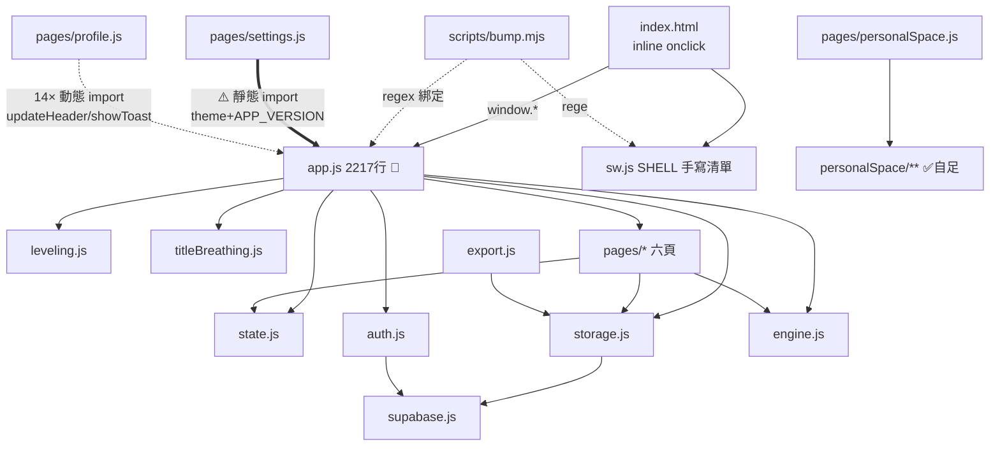

# Refactor Handoff

> 建立日期：2026-07-06｜評估者：Claude（session：重構評估）
> 目的：讓任何新的 coding agent / reviewer agent 打開 repo 即可理解目前狀態、重構目標、風險與決策脈絡，並安全接手。
> **本文件建立當下未進行任何重構，程式碼與 v1.20.3 發佈狀態一致。**

---

## 1. Current Project State

### 1.1 專案是什麼

Orbit——個人成長追蹤 PWA（部署於 <https://yoyocadence.github.io/Orbit/>，repo：`yoyoCadence/Orbit`）。主要功能：

- **任務系統**：即時任務（點擊完成）與專注任務（計時器結算），含價值分級 S/A/B/D、難度、抗拒感
- **XP / 等級 / 稱號**：engine.js 計算 XP，leveling.js 稱號模板（RPG/鬼滅/職場/自訂），titleBreathing.js 動態呼吸流派稱號
- **精力系統**：任務耗能、恢復/娛樂回能、晨間狀態決定初始精力
- **連勝（streak）**：有效日判定、Streak Shield 保護卡（Pro）、45 天連勝解鎖 30 天 Pro
- **本日計劃**、**昨日總結日報**、**週/月回顧**、**習慣熱力圖**、**進階儀表板**
- **佐證照片**：完成任務後拍照存 localStorage（`orbit_proof_*`，不上雲）
- **個人空間**：遊戲化場景系統（`personalSpace/` 子系統，已自成模組）
- **排行榜**（lazy route）、**CSV/PDF 匯出**、**Pro 訂閱 gating**（付費/試用/連勝解鎖三種來源）
- **Supabase 同步**：登入使用者 localStorage↔Supabase 雙向、離線 `_syncPending` 補推；**遊客模式**純本機

### 1.2 技術棧與架構概況

- 純 Vanilla JS ES Modules，**無框架、無 bundler、無 build step**——`pwa/` 目錄原樣部署
- Supabase（PostgreSQL + Auth + Storage），RLS 全開（規範見 repo 根目錄 `CLAUDE.md`）
- Service Worker（`pwa/sw.js`）：HTML network-first、JS/CSS stale-while-revalidate、圖片 cache-first；**SHELL 預快取清單為手寫逐檔列舉**
- 部署：push `main` → GitHub Actions（`.github/workflows/deploy.yml`）→ 上傳 `pwa/` 到 GitHub Pages，無編譯
- 本機開發：`node pwa/server.cjs` → <http://localhost:3000>

分層現況：

| 層 | 檔案 | 健康度 |
|---|---|---|
| 純邏輯 | `engine.js`(276) `leveling.js`(111) `utils.js`(84) `titleBreathing.js`(550) | ✅ 純函式、有測試 |
| 資料 | `storage.js`(532)＝localStorage 同步快取＋`db`（Supabase fire-and-forget）；`auth.js`(44) | ⚠️ 分層清楚但映射手寫重複 |
| 狀態 | `state.js`(14)：單一可變物件 `{user, tasks, sessions, energy, dailyPlan}` | ⚠️ 無 mutation 紀律 |
| 頁面 | `pages/*.js`：每頁 `renderX(container)` 全量 innerHTML 重繪＋事件綁定 | ⚠️ 頁面間重複大量工具碼 |
| 黏合 | **`app.js`（2217 行）** | 🔴 上帝模組，本次重構主標的 |
| 個人空間 | `personalSpace/**`（約 20 檔） | ✅ 已模組化，**不在本次範圍** |

資料流（寫入）：頁面點擊 → `window.completeInstant`/`window.startFocus`（app.js）→ engine 計算 → 組 session 物件 → `_commitSession`：mutate `state` → `storage.saveX`（localStorage 立即寫＋Supabase 背景推）→ `updateHeader()`＋`renderPage()` 全頁重繪。

資料流（開機）：`init()` → 有本機快取先渲染 → 背景 `db.loadFromRemote` → `mergeSessionsById` 合併 → 靜默重繪。跨模組通訊依賴 **33 個 `window.*` 全域函式**（app.js 佔 27 個）＋sessionStorage 旗標；`index.html` 的 inline `onclick` 直接呼叫這些全域名稱。

### 1.3 已知問題

詳見 §5（架構問題）與 §11（Open Questions 中的疑似 bug）。一句話版：app.js 責任過載、settings.js↔app.js 循環依賴、六類重複邏輯、四處繞過資料層的硬編碼 localStorage 存取。

### 1.4 驗證方式（現有）

| 種類 | 指令 | 基準（2026-07-06 實測） |
|---|---|---|
| 單元測試 | `npm test`（Vitest） | **643 passed / 23 檔，0 failed** |
| Lint | `npm run lint`（ESLint 9） | 通過（assumption：本次評估未單獨執行，僅由近期 commit 推定；接手者第一步請實跑一次記錄基準） |
| E2E | `npm run test:e2e`（Playwright） | **assumption：本次評估未執行**，狀態未知；不作為重構驗收依據，僅作參考 |
| 手動 | `node pwa/server.cjs` | 冒煙流程見 §10 |

無 build 指令（無 build step）。

### 1.5 Git 狀態（2026-07-06 快照）

- 分支：`feat/hardware-sensory-foundation`，與 `origin` 同步
- 最近 commit：`0d0ee7a fix: preserve completed session history`
- 工作區：**乾淨**，僅一個未追蹤目錄 `.codex/`（內含 `config.toml`，assumption：本機 agent CLI 設定檔，非 app 程式碼，不要提交、不要刪除）
- 版本：`package.json` 與 `APP_VERSION` 均為 v1.20.3

---

## 2. Refactor Goal

### 2.1 為什麼需要重構

1. **app.js 2217 行承擔 10+ 種責任**，任何功能開發都要在同一檔案內穿梭，agent 與人類都容易誤傷無關區塊
2. **重複邏輯已實際造成過成本**：佐證縮圖功能（PR #120 系列）需要同時改 home 與 goals 兩份 session row；XP 權重表三份靠註解「mirror engine.js exactly」維持一致
3. **循環依賴**（settings.js ⇄ app.js）已迫使 profile.js 用 14 次動態 `import('../app.js')` 繞路、測試被迫 mock app.js
4. **資料層被繞過**：三處硬編碼 `'yoyo_user'`、四處直接操作 `orbit_proof_*`，storage.js 改 PREFIX 或結構會靜默壞掉

### 2.2 要降低的風險 / 要改善的維護性

- 新增 session 欄位從「改 2 處組裝＋3 處映射」降為各 1 處
- 焦點計時器抽離後可補單元測試（目前整段無自動測試保護）
- 斷開循環依賴，讓頁面測試不再 mock app.js
- 讓「改 Pro 導流」「改 session 列外觀」之類的常見改動回到單點修改

### 2.3 明確分類

| 類別 | 內容 | 本次是否處理 |
|---|---|---|
| **重構目標** | 拆分 app.js、去重、斷循環依賴、資料存取一致化 | ✅ 是（§7 Phases） |
| **技術債整理** | sw.js SHELL 自動化、e2e 擴充、storage 映射表化 | 部分（映射表化＝Phase 16；其餘列 follow-up） |
| **新功能需求** | 無 | ❌ 絕對不做 |
| **UI 改版需求** | 無 | ❌ 絕對不做 |
| **Bug 修復** | §11 Q2–Q4 三個疑似 bug | ❌ 不在重構內；待使用者決定後**獨立 commit** 處理 |

### 2.4 不允許改變的外部行為

一句話原則：**重構前後，使用者與 Supabase 觀察到的一切行為必須逐位元相同**。完整清單見 §4。

---

## 3. Non-Goals（本次明確不做）

1. **不新增任何功能**，不加任何 UI 元素或文案
2. **不改 UI 行為與外觀**（含動畫時序、modal 出現時機、按鈕文字）
3. **不改資料格式**：
   - localStorage：`yoyo_` 前綴與所有既有 key 名、值的 JSON 形狀不變
   - `orbit_proof_{sessionId}`、`orbit_shield_pending`、`orbit_dev_backup`、`orbit_sync_last`、`orbit_sync_history`、`orbit_dev_panel` 等 key 名不變
   - session / task / user / energy 物件欄位名不增不減不改名
4. **不改 Supabase schema、不新增 migration、不動 RLS policy**（依 CLAUDE.md 此為高風險項，需另行審批）
5. **不改 routing**：hash 名稱（`#home` 等）、`PAGE_ORDER` 順序、未知 hash fallback 到 home 的行為不變
6. **不改 authentication flow**：登入/註冊/Google OAuth/忘記密碼/遊客模式的畫面順序與 Supabase 呼叫不變
7. **不改 deployment 設定**：`.github/workflows/deploy.yml`、GitHub Pages 結構不動；sw.js 的快取「策略」不動（僅允許在 SHELL 清單**追加**新拆出的檔案路徑）
8. **不改主題 id `'liquid-galss'`**（拼字錯誤但已持久化在使用者 localStorage，改名＝破壞既有使用者設定）
9. **不重構下列自足模組**：`personalSpace/**`、`titleBreathing.js`、`export.js`、`tour.js`、`pages/leaderboard.js`、`pages/personalSpace.js`（assumption：依 import 關係與測試覆蓋判定為低耦合葉模組；本次評估未逐行深讀 export.js/tour.js/leaderboard.js 內部）
10. **不引入任何新依賴、框架、狀態管理庫、bundler**
11. **不動 `.codex/`、不動 `CLAUDE.md`、不動 db/ migration SQL**

---

## 4. Existing Behavior That Must Be Preserved

Reviewer 用此章判斷 unintended behavior change。分七類：

### 4.1 `window.*` 全域 API（最重要的隱性合約）

`index.html` 的 inline `onclick` 與各頁面模板字串直接呼叫以下全域名稱，**重構後每一個名稱都必須存在且行為不變**：

```
navigate, startTour, addToDailyPlan, removeFromDailyPlan,
useStreakShield, dismissStreakShield, reshowShieldBanner, showShieldInfo,
completeInstant, startFocus, endFocus, skipFocus, minimizeFocus, restoreFocus,
togglePauseFocus, toggleFocusDeskMode,
switchAuthTab, loginWithGoogle, togglePasswordVisibility, showForgotPassword,
continueAsGuest, signOut, deleteSession, closeLevelUp,
_dismissTrialBanner, _showResetPasswordModal, _showProofLightbox,
_scrollToProCard, _reviewSetMode, _reviewPrevMonth, _reviewNextMonth,
_isDragging, showToast（settings/goals 等頁呼叫 window.showToast）
```

### 4.2 主要操作流程

- **即時任務**：點擊計劃卡/任務卡 → 反 grind 檢查（同任務每日 ≤3 次）→ XP float → 700ms 後佐證 sheet（僅在 `FileReader` 可用時）
- **專注任務**：Pro 先出時長選擇器（記住 `focusDefaultMinutes`）；倒數模式到時自動結束並出結果選擇器；未達最低有效時間按結束 → 勸留 modal（確定則記 invalid）；「略過」→ 誠實確認語＋時長 pill；暫停/繼續需補償 `startTime`（暫停期間不計時）；縮小 → PiP 徽章繼續計時
- **結算共通**：B 級任務每日 XP 上限（預設 100，`task.dailyXpCap` 可覆蓋）；升級時 600ms 後 level-up overlay＋haptic；invalid 不觸發佐證 sheet
- **撤銷紀錄**：confirm → XP/精力反向沖銷 → Supabase 同步刪除
- **日切**：`effectiveToday(newDayHour)`（預設 05:00 前算前一天）；跨日 watcher 每 60 秒檢查：清空本日計劃、隨機主題（Pro＋開關開）、日報 → 晨間狀態 modal（精力 100/90/75）
- **連勝**：昨日有效日 +1、中斷歸零；Pro 且 prevStreak≥2 時寫入 `orbit_shield_pending` 觸發保護卡橫幅；45 天連勝且從未解鎖 → 送 30 天 Pro＋慶祝 modal；週一結算上週 ≥5 有效日 → +60 XP
- **開機**：有本機快取 → 立即渲染 → 背景同步（sync banner「同步中…→已更新」）；無快取＋有 session → loadAndStart；無 session → 登入畫面

### 4.3 UI 顯示行為

- 換頁 slide 動畫方向依 `PAGE_ORDER` 索引；首次渲染不播動畫
- 水平滑動換頁：|dx|≥60 且非垂直捲動、文字輸入 focus 後 900ms 內不觸發、拖曳中不觸發
- 免費版限制顯示：goals 近 30 天＋鎖卡、review 月視圖近 3 個月、heatmap 90 天（Pro 365）、主題鎖（免費僅 5 款經典）
- 試用橫幅：剩 ≤5 天顯示，關閉後當日不再出現
- 佐證縮圖點擊 → 全螢幕 lightbox（點擊關閉）

### 4.4 localStorage / Supabase 資料行為

- 讀寫一律經 `yoyo_` 前綴 JSON（背景圖 `yoyo_bgImage` 為裸字串例外）
- `storage.saveX` = 同步寫 localStorage ＋ fire-and-forget 推 Supabase（失敗 console.error，session 失敗時標 `_syncPending`）
- `db.loadFromRemote`：先推 pending 再拉；sessions 以 `mergeSessionsById` 合併（remote 覆蓋 local，但保留 local 的 `note`/`taskIconImg`，清除 `_syncPending`）；本機有而遠端無的 session 逐筆補 insert
- `orbit_dev_backup` 存在時 `upsertProfile` 直接 return false（開發者覆蓋模式不上雲）
- 手動同步限流：10 秒冷卻＋每小時 3 次
- 佐證圖片只存本機，**永不上雲**
- 登出：`storage.clearAll()` 清 12 個 key（**不清 `orbit_proof_*`**——現況如此，保持）

### 4.5 API / Supabase 行為

- 僅使用 anon key（`config.js`）；所有表操作帶 `user_id` 過濾；avatars bucket 走 signed URL（7 天）
- `startTrial` 僅在 `trialStartedAt` 為空時觸發一次（15 天）

### 4.6 錯誤處理行為

- Supabase load 失敗 → console.warn＋沿用本機快取（app 照常可用）
- lazy route 載入失敗 → toast「頁面載入失敗」→ fallback renderHome
- 佐證模組載入失敗 → 靜默略過；AudioContext 不可用 → 靜默略過
- 登入錯誤訊息映射（Invalid login → 中文提示；already registered → 引導登入）

### 4.7 權限與登入狀態

- `isProUser() = isPaidProUser() || isTrialUser()`；所有 Pro gate 走 `storage.isProUser()`
- 遊客模式（`continueAsGuest`）：資料僅本機，`db.*` 因無 session 全部靜默 no-op
- `onAuthStateChange`：PASSWORD_RECOVERY → 重設密碼 modal；SIGNED_IN（且尚無 session）→ loadAndStart；SIGNED_OUT → 清空 state＋回登入頁

---

## 5. Architecture Problems Found

> 全部經逐行核對，行號以 v1.20.3 為準。

### P-1 app.js 上帝模組（2217 行、10+ 責任、27 個 window 全域）

- **涉及**：`pwa/js/app.js` 全檔
- **為什麼是問題**：router、swipe、header、焦點計時器（~550 行含桌面模式感測器）、session 結算、streak/週獎勵、日報/晨間 modal、auth 畫面流（~280 行）、主題＋液態玻璃特效（~130 行）、佐證 sheet、init 全在一檔；模組級可變狀態（`focus`、`_liquidGlass*`、`_prevPageIdx`…）彼此相鄰，agent 改 A 極易誤觸 B
- **不處理的成本**：每個新功能都往這裡塞；merge conflict 熱點；無法對計時器等核心邏輯寫單元測試
- **方向**：§6/§7 的 Phase 6–13 逐模組抽出

### P-2 settings.js ⇄ app.js 循環依賴

- **涉及**：`pwa/js/pages/settings.js:3`（靜態 import `applyTheme/applyUiSkin/applyBgImage/removeBgImage/applyRandomThemeForToday/APP_VERSION`）；`pwa/js/pages/profile.js`（14 處 `import('../app.js')` 動態繞路）；`tests/unit/profile.test.js:61`、`tests/unit/settings.test.js:67`（被迫 mock app.js）
- **為什麼是問題**：ES modules 容忍這種循環但脆弱（載入順序敏感）；測試複雜度外溢
- **不處理的成本**：任何 app.js 拆分都會先被這條邊卡住
- **方向**：主題系列函式抽到 `theme.js`、`APP_VERSION` 抽到 `version.js`、`updateHeader` 抽到 header 模組 → 循環消失（Phase 6/8）

### P-3 重複邏輯（六類，皆已核實）

| 重複 | 位置 | 份數 |
|---|---|---|
| `escHtml` | home:408 / goals:106 / review:387 / profile:760 / settings:1281 / leaderboard:223 | 6 |
| XP 權重表 | engine.js:5-8（正本）/ home.js:400-406 / settings.js:1165 | 3 |
| Pro 導流片段 | goals:87 / review:259 / profile:425,445,540 / settings:366 | 6 |
| `FEAT_DETAILS` | settings.js:111 與 settings.js:811（同檔逐字重複） | 2 |
| B-cap＋session 組裝＋佐證觸發 | app.js `completeInstant`(395-457) vs `_submitFocusResult`(1005-1067) | 2 |
| 開機序列／載入 state 五連發 | app.js `continueAsGuest`/`loadAndStart`/`init`（序列×3、載入×4）；「昨天字串」×2（269-272 與 1119-1125） | 3–4 |
| session row HTML＋`RESULT_ICON` | home.js:368-395 vs goals.js:5,42-65 | 2 |

- **不處理的成本**：已實際發生——佐證縮圖需求改了兩處才完整（git log `d964041`、`e7d41ec`）；權重表若調整漏改預覽，UI 顯示與實際結算不一致
- **方向**：Phase 1–5、10、12、13

### P-4 繞過資料層的硬編碼 localStorage 存取

- **涉及**：profile.js:729（`_saveUserLocalOnly` 硬編碼 `'yoyo_user'`）；settings.js:274,283,295,301（dev tools 同樣硬編碼）；`orbit_proof_*` 直接讀寫散落 home.js:378 / goals.js:49 / settings.js:403-412,920-930 / app.js:2117
- **為什麼是問題**：storage.js 的 PREFIX 與 JSON 形狀是內部實作，被四個檔案各自複製；一旦 storage.js 演進，這些點靜默壞
- **不處理的成本**：資料層永遠不能安全演進
- **方向**：Phase 14/15（proofStore、saveUserLocal）

### P-5 storage.js snake_case↔camelCase 欄位映射手寫多份

- **涉及**：storage.js:55-151（讀，profile/tasks/sessions/energy 四段）、154-187 / 217-242 / 250-275（寫）
- **為什麼是問題**：新增一個 profile 欄位要同時改 loadFromRemote＋upsertProfile（＋DB migration），漏一處＝該欄位靜默不同步。git log 顯示每次加欄位（shield、focus 設定…）都要動這兩處
- **不處理的成本**：欄位越多，漏改機率越高；此 bug 類型難察覺（不噴錯，只是資料悄悄丟）
- **方向**：Phase 16 映射表化——**先寫 characterization tests 鎖住現有輸出再動**

### P-6 跨模組通訊依賴 33 個 window 全域＋sessionStorage 旗標

- **涉及**：見 §4.1 清單；旗標：`orbit_shield_dismissed`、`orbit_shield_scroll_top`、`orbit_pro_highlight`、`orbit_streak_unlock_new`
- **為什麼是問題**：無單一註冊點，命名衝突與拼錯無保護；agent 搜尋呼叫端困難
- **方向**：本次**不改機制**（改成 event bus 屬過度設計，見 §6.3），僅在拆檔時讓每個模組自己綁定自己的 window 名稱、旗標 key 集中成常數（Phase 17）

### P-7 焦點計時器無自動測試保護

- **涉及**：app.js:459-1067（focus 狀態機、DOM、感測器混在一起）
- **為什麼是問題**：核心結算路徑之一，`docs/test-plan.md` 明列「不自動測試」，只因它與 DOM/setInterval 纏在一起
- **方向**：Phase 11 抽離後、Phase 18 補純邏輯測試（tick 計算、暫停補償、倒數邊界）

### P-8 命名危險點

- `app.js:1301` `showSyncBanner(state)` 參數遮蔽模組匯入的 `state`（在函式內誤用 `state.user` 會拿到字串）→ Phase 5 改名 `status`
- `today()` vs `effectiveToday()` vs `_eToday()` 三個相近概念——文件化即可，不強行改名
- 主題 id `'liquid-galss'` 拼錯但**必須保留**（§3-8）

### P-9 home.js 拖曳結束用動態 import 已靜態匯入的模組

- **涉及**：home.js:666、794（`import('../storage.js')`，同檔第 4 行已靜態 import）
- **為什麼是問題**：無意義的異步跳轉，讀者誤以為有循環依賴考量
- **方向**：Phase 5 直接改用既有匯入

### P-10 sw.js SHELL 手寫清單 × 無 build step

- **涉及**：`pwa/sw.js:5-60`
- **為什麼是問題**：新增 js 檔不加清單＝不預快取（fetch handler 的 stale-while-revalidate 仍會在首次請求後補快取，所以非致命，但離線首載會缺檔）。**本次重構每個 phase 都會新增檔案，這是每步必查項**
- **方向**：本次逐步手動維護；自動產生 SHELL 列為 follow-up（不在本次範圍）

---

## 6. Proposed Target Structure

### 6.1 目標目錄（新增檔案以 ➕ 標記）

```
pwa/js/
├── app.js                 # 收斂為：init() 開機編排 + 模組組裝 + 相容 re-export（目標 <300 行）
├── version.js          ➕ # APP_VERSION 唯一出處（bump.mjs 同步改指向）
├── router.js           ➕ # SYNC/LAZY_ROUTES、PAGE_ORDER、renderPage、navigate、swipe 換頁
├── theme.js            ➕ # applyTheme/applyUiSkin/隨機主題/背景圖 + 液態玻璃特效
├── sessionFlow.js      ➕ # buildSession、B-cap、commitSession、deleteSession、completeInstant、submitFocusResult
├── focusTimer.js       ➕ # focus 狀態機、桌面模式感測器、chime、時長/結果 picker
├── authFlow.js         ➕ # 登入/註冊/忘記密碼/setup 畫面流、loadAndStart、handleSignOut、continueAsGuest、bootWithLocalState()
├── dayCycle.js         ➕ # eToday、processYesterdayStreak、checkWeeklyBonus、resetEnergyIfNewDay、日切 watcher、日報+晨間 modal
├── ui/
│   ├── feedback.js     ➕ # showToast/showXPFloat/showSyncBanner/showLevelUp
│   ├── sessionRow.js   ➕ # session 列 HTML（home/goals 共用，參數化差異）
│   └── proNav.js       ➕ # goToProCard()（Pro 導流唯一出處）
├── platform/
│   └── proofStore.js   ➕ # orbit_proof_* 的 get/save/clearAll/stats 唯一出處
├── engine.js              # ＋previewBaseXP()（既有檔案小幅擴充）
├── storage.js             # ＋saveUserLocal()；（Phase 16）欄位映射表化
└── (其餘不動)
```

### 6.2 模組責任與依賴方向

依賴只允許「上層 → 下層」，同層互不依賴：

```
[index.html inline onclick]
        ↓ window.*
app.js（編排）
        ↓
router / authFlow / dayCycle / sessionFlow / focusTimer / theme   ← 功能模組層
        ↓
pages/*（只做 UI：讀 state → 產 HTML → 綁事件 → 呼叫功能模組）
        ↓
ui/*（無狀態 HTML/提示元件）    engine / leveling / titleBreathing（純邏輯）
        ↓
state.js（唯一可變狀態）   storage.js（唯一 localStorage＋Supabase 出入口）
        ↓
supabase.js / auth.js / platform/*（外部服務與裝置能力薄封裝）
```

- **只負責 UI**：`pages/*`、`ui/*`（不得直接 `localStorage.*`、不得直接 `supabase.*`）
- **只負責資料**：`storage.js`（含 proofStore 之外唯一的 localStorage 操作點）、`platform/proofStore.js`
- **只負責外部服務**：`supabase.js`、`auth.js`、`platform/badge|share|haptics|proofCapture`
- **循環依賴歸零**：settings/profile 改 import `theme.js`/`version.js`/header 模組，不再 import app.js

### 6.3 刻意保持簡單的地方（反過度設計聲明）

- **不引入狀態管理庫 / event bus / 響應式框架**：全量重繪＋手動 `updateHeader()` 的模式雖原始，但行為可預測、測試已圍繞它建立，且 app 規模（7 頁）不值得遷移成本
- **不做 UI 元件化框架**：`ui/` 只放純函式回傳 HTML 字串，與現有頁面模式一致
- **不改 window.* 通訊機制**：它是 index.html 的合約；改掉是高風險低收益
- **不引入 bundler**：無 build step 是這個 repo 的部署簡單性來源，sw.js 快取策略也依賴逐檔 URL

---

## 7. Refactor Phases

> 通則（每個 phase 一律適用，下方不再重複）：
> - **Validation 基本組**：`npm test`（643 基準必須全過）＋`npm run lint`＋`node pwa/server.cjs` 冒煙（§10.2）
> - **Rollback**：每 phase 恰好一個 commit → `git revert <sha>` 即可單步回退
> - **新增檔案的 phase**：必須把新檔路徑加入 `pwa/sw.js` SHELL（Done criteria 隱含此項）
> - **Expected behavior change：全部 phase 均為「無」**——任何可觀察差異都算失敗

### Phase 1: escHtml 收斂

- **Objective**: 6 份相同的 `escHtml` 收斂為 utils.js 單一匯出
- **Files likely affected**: `utils.js`（+export）、`pages/{home,goals,review,profile,settings,leaderboard}.js`（改 import、刪本地定義）
- **Exact changes**: utils.js 新增與現有 6 份逐字元相同實作的 `export function escHtml`；六頁刪本地函式、頂部加 import
- **Risk level**: 極低
- **Validation method**: 基本組＋手動建含 `<>"&` 的任務名走各頁
- **Done criteria**: `grep -rn "function escHtml" pwa/js` 僅 utils.js 一筆
- **Suggested commit message**: `refactor: dedupe escHtml into utils.js (6 copies → 1)`

### Phase 2: XP 預覽單一來源

- **Objective**: 消除 home/settings 手抄的權重表
- **Files likely affected**: `engine.js`、`pages/home.js`、`pages/settings.js`
- **Exact changes**: engine.js 新增 `previewBaseXP(value, difficulty, resistance)`（內部用既有 `VALUE_WEIGHT/DIFFICULTY_WEIGHT/RESISTANCE_WEIGHT` 常數）；home `xpPreview` 與 settings `updateXPPreview` 改呼叫。**注意：不得改用 `calcBaseXP`**——它檢查 `impactType`，會改變恢復型任務卡的顯示（§11 Q4 之現狀需保留）
- **Risk level**: 低
- **Validation method**: 基本組＋重構前後對照各任務卡/任務 modal 的 XP 標籤逐一相同（含 recovery 任務）
- **Done criteria**: 權重數字（3.2/2.2/1.2/0.4/0.7/1.2/1.4…）在 pwa/js 僅存在於 engine.js
- **Suggested commit message**: `refactor: single-source XP preview weights via engine.previewBaseXP`

### Phase 3: Pro 導流統一

- **Objective**: 6 處導流片段 → `ui/proNav.js` 的 `goToProCard()`
- **Files likely affected**: ➕`ui/proNav.js`、`pages/{goals,review,profile,settings}.js`、`sw.js`
- **Exact changes**: 新模組封裝「set `orbit_pro_highlight` → navigate('settings') → 延時 `_scrollToProCard`」；goals/review/profile 模板中的 inline `onclick` 改為 render 後 `addEventListener`（沿用各頁既有的 post-render 綁定模式）；settings/profile 的 `_goToProCard` 函式刪除改 import
- **Risk level**: 低（inline→listener 需逐點驗證）
- **Validation method**: 基本組＋逐一點擊：goals 鎖卡、review 鎖定月、profile 熱力圖/儀表板升級鈕、settings 鎖主題 → 全部應跳設定並高亮 Pro 卡
- **Done criteria**: `grep -rn "orbit_pro_highlight" pwa/js` 僅 proNav.js 與 settings.js 的消費端兩處
- **Suggested commit message**: `refactor: unify Pro upsell navigation into ui/proNav.js`

### Phase 4: session 列渲染統一

- **Objective**: home/goals 共用一份 session row HTML
- **Files likely affected**: ➕`ui/sessionRow.js`、`pages/home.js`、`pages/goals.js`、`sw.js`
- **Exact changes**: 抽 `sessionRowHtml(session, { showDelete, showNote, showResultLabel })` 與 `RESULT_ICON`；home 帶 `{showDelete:true}`、goals 帶 `{showNote:true, showResultLabel:true}`；佐證縮圖段共用
- **Risk level**: 中低——HTML 輸出必須逐字元等價（app.js `_showProofSheet` 以 `.session-del-btn[data-session-id]` 與 `.log-item` 選擇器注入縮圖，class 名不得變）
- **Validation method**: 基本組（home.test.js/goals.test.js 覆蓋列渲染）＋手動比對兩頁（含佐證縮圖、note、刪除鈕、invalid 樣式）＋完成任務後佐證 sheet 注入縮圖仍成功
- **Done criteria**: 兩頁 session 列 markup 與重構前 diff 為零（可用瀏覽器 devtools 抓 outerHTML 對照）
- **Suggested commit message**: `refactor: extract shared session row renderer (home + goals)`

### Phase 5: 小清理三件

- **Objective**: 同檔重複與明顯異味
- **Files likely affected**: `pages/settings.js`、`pages/home.js`、`app.js`
- **Exact changes**: ① settings 兩份 `FEAT_DETAILS`（111 行/811 行）合併為 module 常數；② home.js:666,794 動態 `import('../storage.js')` 改用頂部既有 import；③ `showSyncBanner(state)` 參數改名 `status`
- **Risk level**: 極低
- **Validation method**: 基本組＋手測拖曳排序（任務卡與計劃列）、同步橫幅、Pro 功能說明 popover
- **Done criteria**: 三處 grep 確認
- **Suggested commit message**: `refactor: dedupe FEAT_DETAILS, drop redundant dynamic imports, rename shadowed param`

### Phase 6: APP_VERSION → version.js（⚠️ 連動 bump.mjs）

- **Objective**: 讓 settings.js 不再為了版本號 import app.js
- **Files likely affected**: ➕`js/version.js`、`app.js`、`pages/settings.js`、**`scripts/bump.mjs`**、`sw.js`
- **Exact changes**: 新檔 `export const APP_VERSION = 'v1.20.3';`；app.js 改 import＋re-export（相容）；settings 改 import version.js；bump.mjs 第 39-44 行的目標路徑與 regex 改指向 `pwa/js/version.js`
- **Risk level**: 中——bump.mjs 只 WARN 不 fail，改壞會**靜默**導致下次發版 APP_VERSION 不更新
- **Validation method**: 基本組＋在乾淨工作區實跑 `node scripts/bump.mjs patch`，確認 version.js/sw.js/package.json/CHANGELOG 四處都被改到，然後 `git checkout -- .` 還原
- **Done criteria**: bump 實測通過且已還原；設定頁仍顯示版本號
- **Suggested commit message**: `refactor: move APP_VERSION to version.js; point bump.mjs at it`

### Phase 7: ui/feedback.js（提示元件）

- **Objective**: showToast/showXPFloat/showSyncBanner/showLevelUp/closeLevelUp 抽出
- **Files likely affected**: ➕`ui/feedback.js`、`app.js`、`sw.js`
- **Exact changes**: 函式整段搬移；`window.closeLevelUp`、（現由 app.js 匯出的）`showToast/showXPFloat/showSyncBanner` 改由 feedback.js 匯出並在 app.js re-export；window 綁定名稱不變
- **Risk level**: 低
- **Validation method**: 基本組＋toast/XP float/level-up overlay/同步橫幅各觸發一次
- **Done criteria**: app.js 不再含這五個函式本體
- **Suggested commit message**: `refactor: extract toast/xp-float/sync-banner/level-up into ui/feedback.js`

### Phase 8: theme.js（含液態玻璃）——斷開循環依賴的一步

- **Objective**: 主題/背景/隨機主題/液態玻璃全段抽出；settings.js 改依賴 theme.js
- **Files likely affected**: ➕`js/theme.js`、`app.js`、`pages/settings.js`、`sw.js`
- **Exact changes**: `applyTheme/applyUiSkin/applyRandomThemeForToday/applyBgImage/removeBgImage/_renderBg`＋`_liquidGlass*` 整段（app.js:1517-1565, 1876-2007）搬入 theme.js；settings.js:3 改 `from '../theme.js'`；app.js 暫時 re-export 以防漏改
- **Risk level**: 中——液態玻璃有 rAF/事件節流與 iOS 權限流程，搬移時不得改邏輯
- **Validation method**: 基本組＋手測：切換全部主題、每日隨機主題開關、背景圖上傳/移除、liquid-galss 主題下滑鼠/傾斜反光（手機實測或 devtools sensor 模擬）＋確認 `import { …applyTheme… } from '../app.js'` 在 pages/ 已不存在
- **Done criteria**: settings.js 對 app.js 的 import 只剩（暫時的）零項或 re-export 過渡項；循環依賴斷開（可用 `npx madge --circular pwa/js` 或人工檢查）
- **Suggested commit message**: `refactor: extract theme + liquid-glass into theme.js, break settings↔app cycle`

### Phase 9: router.js

- **Objective**: 路由、換頁動畫、滑動導航抽出
- **Files likely affected**: ➕`js/router.js`、`app.js`、`sw.js`
- **Exact changes**: `SYNC_ROUTES/LAZY_ROUTES/PAGE_ORDER/currentHash/renderPage/window.navigate/hashchange/swipe`（app.js:43-150）搬移；`renderPage` 供其他模組 import；`window.navigate` 綁定名不變
- **Risk level**: 中——`renderPage` 被結算/日切/shield 等多處呼叫，搬移後所有呼叫端改 import
- **Validation method**: 基本組＋七頁逐一切換（動畫方向正確）、直接改 URL hash、未知 hash fallback、滑動換頁、leaderboard lazy 載入與失敗 fallback（devtools offline 模擬）
- **Done criteria**: app.js 無 routing 邏輯；`grep -n "renderPage" pwa/js` 呼叫端全部走 router.js
- **Suggested commit message**: `refactor: extract hash router + swipe navigation into router.js`

### Phase 10: sessionFlow.js（風險最高，功能核心）

- **Objective**: 結算邏輯單一化，消除 completeInstant/_submitFocusResult 整段重複
- **Files likely affected**: ➕`js/sessionFlow.js`、`app.js`、`sw.js`
- **Exact changes**: 抽 `buildSession(task, {result, durationMinutes, note, startedAt})`（統一 20 欄位組裝）＋`applyDailyCap()`（B-cap）＋`commitSession()`＋`deleteSession`＋`completeInstant`＋`submitFocusResult`；兩條路徑改走同一 buildSession；佐證 sheet 觸發條件（`result!=='invalid' && FileReader 可用`）收斂為一處。`window.completeInstant/deleteSession` 綁定名不變
- **Risk level**: **高**——XP/精力/連勝結算是產品核心
- **Validation method**: 基本組＋**完整結算矩陣手測**：即時任務（S/A/B/D）×3 次觸發反 grind、B-cap 觸頂（改 dailyXpCap 小值驗證）、計時任務 complete/partial/invalid、恢復型回能、娛樂 quality 衰減（>60 分鐘後）、升級觸發、撤銷沖銷、佐證 sheet 出現時機（invalid 不出）
- **Done criteria**: app.js 不再含 session 組裝欄位清單；`buildSession` 僅一處；643 測試全過
- **Suggested commit message**: `refactor: extract session build/commit into sessionFlow.js (dedupe instant vs focus paths)`

### Phase 11: focusTimer.js

- **Objective**: 焦點計時器狀態機整段抽出（app.js:459-1003 約 550 行）
- **Files likely affected**: ➕`js/focusTimer.js`、`app.js`、`sw.js`
- **Exact changes**: `focus` 物件、時長選擇器、desk mode 感測器系列、`_launchFocus/_tickFocus/_playFocusChime`、end/skip/minimize/restore/pause、早退 modal、結果 picker → 完成時呼叫 sessionFlow 的 `submitFocusResult`。八個 `window.*` 綁定名不變
- **Risk level**: 中高——setInterval 時序、暫停補償、感測器清理容易搬壞
- **Validation method**: 基本組＋手測：正計時與倒數模式、暫停≥30 秒後繼續（時間不得跳動）、倒數到時自動結束＋音效（Pro）、最低有效時間里程碑提示、早退 modal、略過打卡、PiP 縮小/還原、桌面模式手動切換與（可測時）平放自動觸發、離開後感測器 listener 已移除（devtools getEventListeners 檢查）
- **Done criteria**: app.js 無 focus 相關碼；計時全流程手測通過
- **Suggested commit message**: `refactor: extract focus timer state machine into focusTimer.js`

### Phase 12: dayCycle.js

- **Objective**: 日切與日常結算邏輯抽出
- **Files likely affected**: ➕`js/dayCycle.js`、`app.js`、`sw.js`
- **Exact changes**: `_eToday/_getYesterdayStr`（合併為一處）、`processYesterdayStreak`、`checkWeeklyBonus`、`resetEnergyIfNewDay`、`_startDayWatcher`、`showDailyReport`＋`_reportSuggestions`、`showMorningModal`、streak shield 系列 window handler、`showStreakUnlockModal` 搬移；「昨天字串」重複在此消除
- **Risk level**: 中——日期邏輯錯誤不易立刻察覺
- **Validation method**: 基本組＋手測：改 `newDayHour` 後 `_eToday` 判定、以 dev 手段調整 `lastResetDate`/`lastStreakDate` 觸發日報→晨間 modal、shield 橫幅使用/放棄/重新顯示
- **Done criteria**: app.js 無日切邏輯；`grep -n "toLocaleDateString('sv')" pwa/js/app.js` 歸零
- **Suggested commit message**: `refactor: extract day-cycle (streak/report/morning/watcher) into dayCycle.js`

### Phase 13: authFlow.js＋app.js 收斂

- **Objective**: auth 畫面流抽出；開機序列去重；app.js 收斂為編排層
- **Files likely affected**: ➕`js/authFlow.js`、`app.js`、`sw.js`
- **Exact changes**: 登入畫面/分頁切換/Google/忘記密碼/重設密碼 modal/setup 畫面/`loadAndStart`/`handleSignOut`/`continueAsGuest` 搬移；三處重複的「載入五項 state＋processYesterdayStreak＋日報判斷＋showMainApp＋checkWeeklyBonus」統一為 `bootWithLocalState()`；app.js 留 init()＋warm imports＋佐證 sheet/lightbox＋header＋viewport 高度同步（或再細拆，接手者自行判斷是否值得）
- **Risk level**: 中高——auth 無自動測試
- **Validation method**: 基本組＋手測三路徑：帳密登入（含錯誤訊息）、遊客模式、登出→重登；忘記密碼寄信 UI（可只驗 UI 不真寄）；首次註冊 setup 流程（清 localStorage 模擬新用戶）
- **Done criteria**: app.js <300 行；開機序列僅一份
- **Suggested commit message**: `refactor: extract auth screens + unify boot sequence into authFlow.js`

### Phase 14: platform/proofStore.js

- **Objective**: `orbit_proof_*` 存取單一化
- **Files likely affected**: ➕`platform/proofStore.js`、`pages/{home,goals,settings}.js`、佐證 sheet 所在模組、`sw.js`
- **Exact changes**: `getProof(sessionId)/saveProof(sessionId, dataUrl)/clearAllProofs()/proofStats()`；key 格式 `orbit_proof_{sessionId}` **不變**；四處呼叫端改走此模組
- **Risk level**: 低
- **Validation method**: 基本組＋手測：拍佐證→首頁縮圖→紀錄頁縮圖→lightbox→設定頁統計數字→清除→兩頁縮圖消失
- **Done criteria**: `grep -rn "orbit_proof_" pwa/js` 僅 proofStore.js
- **Suggested commit message**: `refactor: centralize proof image storage in platform/proofStore.js`

### Phase 15: storage.saveUserLocal()

- **Objective**: 消除三處硬編碼 `'yoyo_user'`
- **Files likely affected**: `storage.js`、`pages/profile.js`、`pages/settings.js`
- **Exact changes**: storage.js 新增 `saveUserLocal(u)`（只寫 localStorage 不觸發同步——與現有 `saveUser` 的差異務必保留）；profile `_saveUserLocalOnly` 刪除改呼叫；settings dev tools 的讀寫改走 `storage.getUser()`/`saveUserLocal()`（`orbit_dev_backup` 備份字串格式不變）
- **Risk level**: 低
- **Validation method**: 基本組＋手測：改名/頭像/稱號模板（確認「本機先存、背景同步」狀態文字仍正確）、dev 面板等級模擬與還原
- **Done criteria**: `grep -rn "yoyo_user" pwa/js` 僅 storage.js
- **Suggested commit message**: `refactor: add storage.saveUserLocal, remove hardcoded yoyo_user keys`

### Phase 16: storage.js 欄位映射表化（先測後改）

- **Objective**: snake↔camel 映射從 4 處手寫變單一 FIELD_MAP
- **Files likely affected**: `storage.js`、➕`tests/unit/storage-mapping.test.js`
- **Exact changes**: **步驟一（獨立 commit）**：寫 characterization tests——以固定輸入物件呼叫現行 loadFromRemote 映射段/upsert payload 組裝段，快照全部欄位輸出。**步驟二**：以 `PROFILE_FIELDS = [['user_id','id'],…]` 形式的表生成雙向轉換，預設值語義（`?? / ||` 的差異！如 `last_streak_date || ''` vs `is_public ?? false`）逐欄位保留
- **Risk level**: **高（動資料層）**——`||` 與 `??` 混用是刻意的（空字串 vs null 語義），表化時最容易改壞
- **Validation method**: 新測試＋基本組＋登入帳號實測雲端來回（改名→同步→清快取→重登→資料完整）
- **Rollback method**: revert 步驟二 commit（步驟一的測試保留，無害）
- **Done criteria**: 新增欄位只需改一行 FIELD_MAP 即完成雙向；characterization 測試全過
- **Suggested commit message**: `test: characterize storage field mappings` ＋ `refactor: table-drive storage snake/camel field mapping`

### Phase 17: 旗標 key 常數化

- **Objective**: `orbit_shield_pending` 等 sessionStorage/localStorage 旗標 key 集中
- **Files likely affected**: ➕`js/flags.js`（或併入 utils）、app/home/profile/settings 等呼叫端
- **Exact changes**: key 字串值**完全不變**，僅來源集中
- **Risk level**: 極低
- **Validation method**: 基本組＋shield 全流程手測
- **Done criteria**: 旗標字面值僅出現於常數定義處
- **Suggested commit message**: `refactor: centralize storage flag keys`

### Phase 18（選配）: 測試補強與收尾

- **Objective**: ① focusTimer 純邏輯單元測試（tick、暫停補償、倒數邊界、最低有效時間）；② profile.js 14 處 `import('../app.js')` 改靜態 import（此時已無循環）；③ 移除測試中不再需要的 app.js mock
- **Risk level**: 低
- **Validation method**: 基本組；測試數應 >643
- **Suggested commit message**: `test: add focus timer unit tests; use static imports post-cycle-break`

---

## 8. Dependency Map

### 8.1 現況（重構前）



### 8.2 高風險節點（被多處依賴，改動需加倍小心）

| 檔案 | 依賴者 | 風險說明 |
|---|---|---|
| `state.js` | 全部頁面＋app.js | 形狀改變＝全域壞；本次不改形狀 |
| `storage.js` | app、全部頁面、export | localStorage key 與 Supabase 映射是**資料相容性邊界** |
| `engine.js` | app、home、review、profile、titleBreathing、export | 數值公式=產品公平性；本次只加 `previewBaseXP`，不改既有函式 |
| `app.js`（現況） | index.html、settings（靜態）、profile（動態）、全部 window.* 呼叫端 | 拆解主標的；每步都要保 re-export 相容 |
| `utils.js` | 幾乎全部 | `effectiveToday` 的日切語義被 streak/報表/heatmap 依賴 |
| `sw.js` | 部署後所有離線行為 | 新增檔漏列 SHELL＝離線首載缺檔 |

### 8.3 目標（重構後）

見 §6.2 分層圖——關鍵差異：settings/profile 不再依賴 app.js；app.js 只依賴功能模組；`madge --circular` 應為零。

---

## 9. Risk Register

| # | Risk | Cause | Impact | How to detect | Mitigation | Rollback |
|---|---|---|---|---|---|---|
| R1 🔴資料 | localStorage key 或 JSON 形狀被意外改變 | 拆檔時「順手整理」key 名/欄位 | 既有使用者資料讀不到（看似掉資料） | 每 phase 後以既有資料重載 app；`grep` key 字面值 | §3-3 白名單；Phase 16 先寫 characterization test | revert 該 commit（localStorage 本身未毀，讀回即復原） |
| R2 🔴資料 | Supabase 映射欄位漏搬/預設值語義改變（`??` vs `\|\|`） | Phase 16 表化 | 欄位靜默不同步、雲端資料髒 | characterization tests；登入帳號雲端來回實測 | 表化前先鎖測試；逐欄位 code review | revert 步驟二 commit |
| R3 🔴UI | `window.*` 名稱漏綁 | 拆檔時忘了 re-bind | index.html 按鈕點了沒反應（console ReferenceError） | 冒煙必點清單（§10.2 全按鈕）；console 零錯誤檢查 | §4.1 清單逐一核對；每 phase 只搬一個模組 | revert |
| R4 🔴UI | 焦點計時器時序壞（暫停補償/倒數） | Phase 11 搬移中改動 startTime 邏輯 | XP 結算錯誤、計時跳動 | 暫停 30 秒後繼續看錶；倒數到時行為 | 逐行搬移不改寫；Phase 18 補測試 | revert |
| R5 🔴build/deploy | bump.mjs regex 失配 | Phase 6 移動 APP_VERSION 後忘改腳本 | **靜默**：下次發版版本號不更新、SW CACHE 不換 → 使用者拿到舊快取 | bump 腳本輸出有 WARN 字樣；Phase 6 驗證步驟強制實跑 | Phase 6 內同 commit 改腳本＋實測 | revert |
| R6 🔴build/deploy | 新模組檔漏加 sw.js SHELL | 每個新增檔案的 phase | 離線首載缺檔（線上因 SWR fallback 不易察覺） | 每 phase Done criteria 檢查；devtools offline 模式冷載 | 檢查表制度化（§10.3 reviewer 必查） | 補一行即可 |
| R7 🔴agent 誤判 | agent 把「重複但語義不同」誤合併 | `_compressImage`（方形裁切）vs `proofCapture.compressImage`（等比）；`saveUser`（觸發同步）vs `saveUserLocal`（不觸發） | 頭像變形/意外上雲 | code review 盯這兩組 | 本文件明文標記：**這兩組不是重複，不得合併** | revert |
| R8 🔴agent 誤判 | agent 看到 `'liquid-galss'` 拼錯順手改名 | 拼字檢查本能 | 既有使用者主題失效 | grep 'liquid-glass'（正確拼法出現＝出事） | §3-8 明文禁止 | revert＋確認無 migration 寫入 |
| R9 UI | 循環依賴斷開順序錯誤導致模組載入期 TDZ 錯誤 | Phase 8 前就先動 settings import | 白屏（console: Cannot access before initialization） | 開機冒煙 | 嚴格按 phase 順序；app.js 過渡期保持 re-export | revert |
| R10 流程 | 一個 phase 混入行為修正（如順手修 §11 的 bug） | 善意 | reviewer 無法區分重構 diff 與行為 diff | reviewer 對照 §4 checklist | 鐵律：bug 修復獨立 commit、獨立於重構 PR 或明確分開 | 拆 commit |

---

## 10. Verification Plan

### 10.1 自動驗證（每 phase 必跑）

```bash
npm test          # 基準 643 passed / 23 files，必須全過且不減少
npm run lint      # 必須通過
# 無 build step。e2e（npm run test:e2e）非必跑：assumption—本評估未確認其可運行狀態
```

### 10.2 手動冒煙（每 phase 必跑，約 5 分鐘）

`node pwa/server.cjs` → http://localhost:3000：

1. 開機進入首頁，console 無紅字
2. 即時任務點擊完成 → XP float → 佐證 sheet 出現 → 跳過
3. 專注任務 → 計時 → 暫停/繼續 → 結束 → 選「完成」→ 佐證 sheet
4. 首頁今日紀錄列有縮圖/刪除鈕；撤銷一筆 → XP 回沖
5. 七頁全部切換一輪（含 leaderboard lazy 載入），滑動換頁一次
6. 設定：切主題、切 UI skin、開關隨機主題（Pro）
7. 個人頁：熱力圖、儀表板、稱號切換
8. 登出 → 遊客模式進入 → 登出 → 帳號重登（資料從雲端回來）

### 10.3 涉及特定 phase 的追加驗證

見各 phase 的 Validation method（§7）。凡新增檔案：**檢查 sw.js SHELL 已含該路徑**。

### 10.4 測試缺口與最小保護（現況誠實聲明）

| 無自動測試的區域 | 風險 | 最小保護做法 |
|---|---|---|
| 焦點計時器狀態機 | Phase 11 | 抽離後 Phase 18 補純邏輯測試；抽離前**只能靠手測**（§7 Phase 11 清單） |
| auth 畫面流 | Phase 13 | 手測三路徑（帳密/遊客/登出重登）；不真寄重設信 |
| app.js 開機編排 | Phase 9/12/13 | 冒煙第 1 項＋清 localStorage 模擬新用戶 |
| storage 欄位映射 | Phase 16 | **先寫 characterization tests 再動**（該 phase 內建） |
| sw.js/佈署 | Phase 6 | bump.mjs 實跑驗證＋devtools offline 冷載 |

### 10.5 Reviewer 應檢查項

見 §13。

---

## 11. Open Questions

### Q1：重構範圍核准

- **Question**: 執行全部 Phase 1–17（＋選配 18），或先 Phase 1–13（app.js 拆解為止），或僅 Phase 1–5（低風險去重）？
- **Why it matters**: 決定 PR 大小與驗收時間；Phase 16 動資料層風險最高，可獨立延後
- **Options**: (a) 全做 (b) 1–13 (c) 1–5 (d) 自訂
- **Recommended answer**: (b) 1–13 先出一個 PR，14–17 視結果second PR——資料層改動與大拆解不要擠同一個 review
- **Consequence if ignored**: agent 無從開工，或一口氣做完導致 review 不可能仔細

### Q2：週視圖 UTC 日期 bug 是否修復（行為變更）

- **Question**: `pages/review.js:60` 用 `toISOString().slice(0,10)`（UTC）產生 7 天窗口；UTC+8 使用者早上 8 點前看週視圖，整個窗口前移一天。修嗎？
- **Why it matters**: 這是真實使用者可見的錯誤資料；但修復＝行為變更，不屬重構
- **Options**: (a) 修，改 `toLocaleDateString('sv')` 與全 app 一致，獨立 commit `fix:` (b) 不修，維持現狀
- **Recommended answer**: (a)——與 codebase 其餘部分一致才是「正確的既有行為」
- **Consequence if ignored**: 台灣時區使用者早晨看到錯置的週統計；且 Phase 內若有人「順手」修掉會污染重構 diff

### Q3：profile.js 升等公式說明文字過時（行為變更・文案）

- **Question**: `profile.js:245` 仍顯示 v1.4.0 舊公式文字，engine.js 已是 v1.4.1 分段公式。更新嗎？
- **Options**: (a) 修文案（獨立 commit） (b) 不動
- **Recommended answer**: (a)，一行文案，獨立 commit
- **Consequence if ignored**: 使用者看到與實際不符的公式說明

### Q4：恢復型任務 XP 標籤誤導（行為變更・產品決策）

- **Question**: home.js 任務卡對「恢復型且 value≠D」的任務顯示 `+XX XP`，但結算實際為 0 XP（engine 只給 impactType==='task'）。要改顯示、改結算、還是維持？
- **Why it matters**: 這是產品規則層面的不一致，需要產品決策而非工程判斷
- **Options**: (a) 卡片改顯示「回能」 (b) 維持現狀 (c) 讓恢復型也給 XP（大改，不建議）
- **Recommended answer**: (a)，但**本次重構一律先維持現狀**（Phase 2 已明文要求保留此顯示語義），決策後另開 issue
- **Consequence if ignored**: 使用者對恢復任務的 XP 預期落空

### Q5：版本號策略

- **Question**: 重構 PR 的版本 bump 用 patch（v1.20.4）？
- **Why it matters**: repo 慣例「PR 即版本」；SW CACHE 名綁版本，必須 bump 才會讓使用者換快取
- **Options**: (a) patch (b) minor
- **Recommended answer**: (a) patch——零功能變化
- **Consequence if ignored**: 不 bump 則使用者 SW 快取不刷新，拿不到重構後的檔案組合，**可能新舊檔混用出錯**（SHELL 檔案清單變了但 CACHE 名沒變）

### Q6：e2e 基準

- **Question**: 開工前要不要先跑一次 `npm run test:e2e` 建立基準？
- **Why it matters**: 本評估只跑了單元測試（643）；e2e 現況未知（assumption）
- **Options**: (a) 開工前跑一次記錄結果，能過就納入每-phase-group 驗證 (b) 忽略 e2e
- **Recommended answer**: (a)，若本來就紅則記錄「pre-existing failure」，不歸咎重構
- **Consequence if ignored**: e2e 若在重構後紅掉，無法判斷是誰弄壞的

---

## 12. Next Agent Instructions

**開工前（按順序讀）**：

1. 本文件全文（特別是 §3、§4、§7、§9 的 R7/R8）
2. repo 根 `CLAUDE.md`（Supabase 安全規則與高風險變更審批規則）
3. `pwa/js/app.js` 通讀一遍（不用背，知道區塊分佈）
4. `pwa/js/storage.js`、`pwa/js/state.js`、`pwa/index.html`（window.* 合約）
5. `pwa/sw.js`（SHELL 清單）與 `scripts/bump.mjs`（Phase 6 前必讀）

**開工條件**：§11 Q1 已獲使用者答覆。未答覆前**不得動工**。

**執行規則**：

- 從獲准範圍的最小編號 phase 開始，**嚴格按順序**（Phase 8 斷循環依賴前，不得先做依賴它的步驟）
- 一個 phase＝一個 commit，commit message 用 §7 建議值；**絕不在重構 commit 裡夾帶 §11 Q2–Q4 的 bug 修復或任何行為變更**
- 每 phase 完成：跑 §10.1 自動驗證＋§10.2 冒煙＋該 phase 專屬驗證，全綠才進下一個
- 新增檔案必加 `sw.js` SHELL（同 commit）
- **不應該做**：合併 `_compressImage` 與 `proofCapture.compressImage`（語義不同）；改 `'liquid-galss'`；改任何 localStorage key；動 `personalSpace/**`；「順手」修 bug；引入依賴；改 `docs/` 其他文件

**停止並回報的時機**：

- `npm test` 出現任何 fail 且 10 分鐘內無法確認原因 → 停，revert 到上一綠點，回報
- 發現本文件描述與程式碼實況不符 → 停，回報差異（文件可能過時），修正文件後再續
- 發現必須改變外部行為才能繼續 → 停，列入 Open Questions 回報使用者
- 完成 Phase 5、Phase 13、Phase 17 三個里程碑時 → 停，交 reviewer（見 §13）做階段驗收

---

## 13. Reviewer Agent Instructions

你的任務**不是寫 code**，是驗收。對每個階段（P1–5 / P6–13 / P14–17）：

**檢查清單**：

1. **Scope 符合**：diff 中每個 hunk 都能對應到 §7 某個 phase 的 Exact changes；出現對應不到的變更＝undocumented change → blocking
2. **外部行為不變**：抽查 §4 清單——重點：§4.1 全域名稱逐一 `grep` 仍被綁定；§4.2 結算矩陣（若動了 Phase 10/11）實際手測；§4.4 localStorage key `grep` 白名單外零新增/零改名
3. **資料格式/API 零變更**：`git diff` 過濾 `storage.js`、`supabase` 呼叫、所有字串 key；session/task/user 欄位名集合前後相等；**無任何 `pwa/db/` 或 schema 相關變更**
4. **build/deploy 完整性**：每個新增 `.js` 檔存在於 `sw.js` SHELL；若含 Phase 6，實跑 `node scripts/bump.mjs patch` 驗證後還原
5. **測試**：`npm test` ≥643 全綠；`npm run lint` 過；被刪除或跳過的測試＝blocking
6. **重構純度**：diff 中不得混入 §11 Q2–Q4 修復或任何文案/樣式變更（`assets/style.css` 應零 diff；`index.html` 應零 diff）
7. **R7/R8 專項**：確認兩個 compressImage 未被合併、`liquid-galss` 未被「修正」

**輸出格式（必須）**：

```
Verdict: PASS / FAIL
Blocking issues:      （空則寫 none）
Non-blocking issues:  （建議但不擋 merge）
Suggested follow-up tasks:
```

FAIL 條件：任何 blocking issue（行為變更、資料格式變更、測試變紅、undocumented change、SHELL 漏檔）。

---

## 14. Final Summary

- **現在做到哪**：重構「評估與計畫」完成（2026-07-06），**程式碼零改動**；基準：v1.20.3、643 unit tests 全綠、分支 `feat/hardware-sensory-foundation` 乾淨（僅 `.codex/` 未追蹤）
- **下一步**：等使用者回答 §11 Q1（範圍）與 Q2–Q4（三個 bug 是否另行修復）→ coding agent 按 §12 從 Phase 1 開始
- **最大風險**：Phase 10（session 結算抽離，產品核心）與 Phase 16（storage 映射表化，資料相容性）；兩者都有專屬對策（結算矩陣手測／characterization tests 先行）
- **絕對不要碰**：localStorage key 名與 JSON 形狀、Supabase schema 與 RLS、`window.*` 全域名稱、`'liquid-galss'`、`personalSpace/**`、部署設定、`index.html` 與 `assets/style.css`（本次重構應對兩者零 diff）
